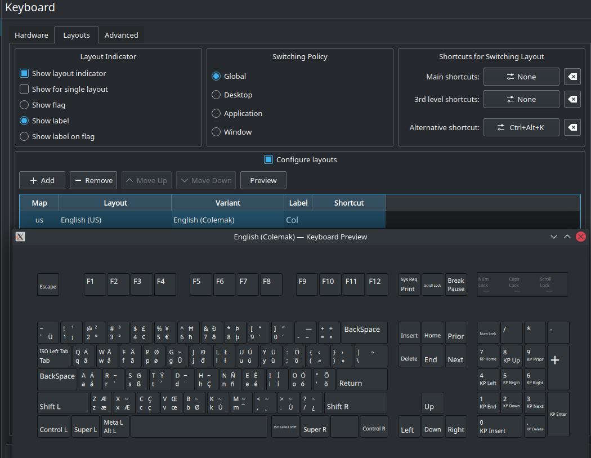

Once again, welcome to Linux-land. Even changing a simple thing such as your keyboard configuration, while extremely flexible, will require some thorough and extraneous background reading both.

If you are using KDE/Gnome and only wish to change the keyboard binding for Xorg (basically applications running in the GUI), rejoice, it's simple, use the GUI settings.

If you are using Arch Linux/Debian without KDE or Gnome, you'll need to read the documentation. See this great answer for how it should work - https://unix.stackexchange.com/questions/479673/changing-the-keyboard-layout-mapping-on-both-the-console-tty-and-x-in-an-x-con. Note that the instructions for Arch Linux do not involve modifying the `/etc/X11/xorg.conf.d/00-keyboard.conf` but rather use `localectl` to modify the virtual console and Xorg keyboard layouts separately.

If you are using KDE but read the Arch Linux documentation naively expecting various distributions to edit the same configuration file, gg.com, you've just wasted a few hours enjoying the wondrous delights of Linux-land.

If you only want to change the keyboard layout for either your virtual console or GUI, easy-peasy. For both, triple, quadruple, nay quintuple the time required to debug and just understand the whys and whats.

Just why - https://unix.stackexchange.com/questions/178002/what-is-the-difference-between-x11-keymapping-and-virtual-console-keymapping

Also, take note of your keyboard's hardware layout. Most US/Asian keyboards correspond to `pc101` and `pc104`, and European to `pc102` and `pc105`.

My Lenovo Yoga 7i fits `pc104`. How do I know?

Some background - https://superuser.com/questions/1216499/is-my-keyboard-generic-101-key-pc-or-generic-105-key-pc-intl-or-what, https://en.wikipedia.org/wiki/IBM_PC_keyboard#Keyboard_layouts, and https://en.wikipedia.org/wiki/Keyboard_layout#Mechanical.2C_visual_and_functional_layouts.

Else, if you are running KDE or Gnome, the *Settings* for both has this wonderful *Preview* mode. Screenshot for Kubuntu:



That is enough to figure out your keyboard layout.

If you do not have KDE or Gnome, fret not.

1. https://askubuntu.com/questions/380052/how-to-use-xkbprint
2. https://askubuntu.com/questions/459915/show-keyboard-layout-chart-from-command-line/
3. https://superuser.com/questions/1293956/show-keyboard-geometry-model-in-gnome
4. `/usr/share/X11/xkb/geometry`

# Setting up your keyboard on KDE and the virtual console both

1. Follow the instructions in [Setting up Debian without Gnome or KDE](#setting-up-debian-without-gnome-or-kde). This will configure the keyboard for the virtual console.

2. Use KDE's *System Settings* to add your desired keyboard bindings.

3. KDE will store the keyboard settings in the /home/user/.config/kxkbrc file.
   The file contents for Yoga 7i are below.

   [$Version]\
   update_info=kxkb_variants.upd:split-variants

   [Layout]\
   DisplayNames=Col\
   LayoutList=us\
   LayoutLoopCount=-1\
   Model=pc104\
   Options=caps:backspace,parens:swap_brackets,shift:both_capslock,lv3:ralt_alt\
   ResetOldOptions=true\
   ShowFlag=false\
   ShowLabel=true\
   ShowLayoutIndicator=true\
   ShowSingle=false\
   SwitchMode=Global\
   Use=true\
   VariantList=colemak\

## Setting up Debian without Gnome or KDE

```bash
# dpkg-reconfigure keyboard-configuration

# update-grub

# service keyboard-setup restart

# exit

$ reboot #unnecessary to reboot, but just do it if you're not running a server, eh?
```

The effects of the above commands are stored in /etc/default/keyboard file. See https://wiki.debian.org/Keyboard. This will affect both the virtual console and Xorg's keyboard settings.

## Troubleshooting

If changes to /etc/default/keyboard do not apply after restarting, **it is possible that the changes are being overridden by gsettings**. For instance, if XKBOPTIONS set in /etc/default/keyboard are not working, check using:

gsettings get org.gnome.desktop.input-sources xkb-options

and reset if necessary:

gsettings reset org.gnome.desktop.input-sources xkb-options

I-Bus can also sometimes override settings from /etc/default/keyboard. The keyboard setup dialog in GNOME 3 will modify IBus's configuration directly, but for users of other X environments, you can use the ibus-setup command to modify the settings for IBus. To force it to defer to the settings from /etc/default/keyboard, run ibus-setup, go to the Advanced tab, and check Use system keyboard layout.

**KDE will override the settings from /etc/default/keyboard file too.**

## Other distros like Arch Linux which follow the old-fashioned and proper way

1. Virtual console only

   1. https://wiki.archlinux.org/title/Linux_console/Keyboard_configuration#Loadkeys
      1. Do use the `--no-convert` flag with the `localectl` command.

2. So far so good? For Xorg:

   1. https://wiki.archlinux.org/title/Xorg/Keyboard_configuration
      1. Once again, if going the `localectl`  command route, use the `--no-convert` flag.

3. ```bash
   # update-initramfs -u && update-grub
   
   # reboot
   ```

4. Getting the current keyboard layout

   1. `setxkbmap -print -verbose 10`
   2. `setxkbmap -query`
   3. `localectl status`

If curious, some good manual pages to read:

1. keyboard
2. localectl
3. xkeyboard-config
4. setxkbmap
5. vconsole.conf
6. /usr/share/X11/xkb/rules/evdev

Validation after the fact

https://askubuntu.com/questions/1003640/why-does-setxkbmap-de-not-have-an-effect-in-a-terminal

https://askubuntu.com/questions/1211307/persistent-remapping-of-keys-with-setxkbmap-or-xorg-configuration <-- lol.

# Advanced

1. Look at all the options
   1. The source code for all the options is in `/usr/share/X11/xkb/symbols`. If you want to add some new options, add them directly to the code.
2. If you want to change the keyboard mappings for individual keys also, same thing - edit the source code.
   1. https://askubuntu.com/questions/325272/permanent-xmodmap-in-ubuntu-13-04/347382#347382?newreg=4eb097870a15490ebbe39d78412f9797
   2. `xmodmap` is ancient ant not recommended, but worth a look at.
      1. https://ictsolved.github.io/remap-key-in-linux/
   3. https://unix.stackexchange.com/questions/84707/how-can-i-make-ctrl-alt-act-like-alt-gr-in-ubuntu
3. `xmodmap -pm` - to list modifier keys
4. Interesting discussion
   1. https://bbs.archlinux.org/viewtopic.php?id=254313
5. `xev` to test your key bindings worked